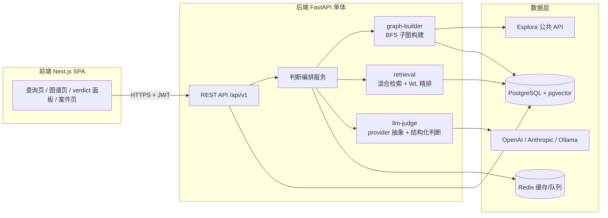

# PatternTrace 前后端分离设计报告

> 版本：v1.0 ｜ 日期：2026-08-22 ｜ 状态：设计评审稿
> 配套产品介绍页：`pattern_trace/output/index.html`

## 1. 执行摘要

PatternTrace 是一个面向交易所与机构风控调查员的**链上洗钱模式检索与判断平台**。用户输入一个区块链地址，系统以该地址为根节点构建受控交易子图，与知识库中已证实的洗钱交易子图进行结构 + 语义混合检索，再由 LLM 输出带证据引用的四档风险判断（high / medium / low / no_match），并支持案件留存与报告导出。

本报告基于 `pattern_trace/product-design.md` 设计定稿，结合 Chainalysis、TRM Labs、Elliptic、MistTrack 等竞品调研，给出完整的前后端分离工程设计与实施路线。

### 核心结论

1. **差异化成立**：主流竞品以全量实体图谱 + 地址标签为核心资产，PatternTrace 聚焦"已知洗钱 pattern 的可解释结构检索"，是错位竞争而非正面竞争。
2. **前后端完全解耦可行**：前端为 Next.js SPA，后端为 FastAPI 单体 + 三个领域模块（graph-builder / retrieval / llm-judge），通过 RESTful API + JWT 通信；MVP 阶段无需微服务拆分，模块边界即为未来拆分边界。
3. **最大工程风险在子图构建**：BFS 扇出爆炸与公共 API 限流是首要风险，设计稿中的三重裁剪 + 五类终止条件 + 缓存预取机制必须作为 P0 落地。
4. **最大产品风险在 LLM 可信度**：幻觉与引用越界通过 JSON Schema 强约束 + 代码层证据校验 + prompt 版本化 + 结果缓存四重机制控制；`no_match ≠ 安全` 的兜底逻辑是产品可信度的关键设计。

---

## 2. 产品调研

### 2.1 产品定位

| 维度 | 内容 |
|---|---|
| 一句话定位 | 输入区块链地址，检索已知洗钱子图模式，LLM 给出可解释四档风险判断 |
| 目标用户 | 交易所 / 机构风控调查员、合规分析人员 |
| 核心工作流 | 地址输入 → 子图构建 → 混合检索 → LLM 判断 → 图谱可视化 → 案件留存 / 报告导出 |
| MVP 数据范围 | 最近 90 天（可配置）+ 预置演示地址集，链为 BTC |
| 商业叙事 | 不做全量实体图谱，专注已知洗钱 pattern 的可解释检索器 |

### 2.2 风险判断模型

| risk_level | 含义 | recommended_action |
|---|---|---|
| high | 命中已知洗钱 pattern 且置信度高 | freeze（冻结/拦截） |
| medium | 存在部分相似特征，需进一步排查 | monitor（监控） |
| low | 与已知 pattern 无明显相似 | none |
| no_match | 未命中任何已知 pattern | review（人工复核） |

**关键原则**：`no_match ≠ 安全`。未命中已知 pattern 不代表地址干净，默认进入人工复核队列，保证产品逻辑闭环。

### 2.3 竞品对比

| 能力 | Chainalysis | TRM Labs | Elliptic | MistTrack | **PatternTrace** |
|---|---|---|---|---|---|
| 核心资产 | 全量实体图谱 + 地址标签 | 实体图谱 + 风险 API | 实体图谱 + 数据集 | 多链标签 + 追踪 | **已证实洗钱子图知识库** |
| 检索范式 | 规则 + 图谱遍历 | 规则 + 图谱 | 规则 + 图谱 | 规则 + 路径追踪 | **图结构 + 语义混合检索** |
| 判断输出 | 风险评分 / 分类 | 风险评分 | 风险评分 | 风险评分 | **四档判断 + 证据引用 + LLM 推理** |
| 可解释性 | 中（规则可查） | 中 | 中 | 中 | **高（引用子图中真实节点/交易）** |
| 案件闭环 | 强（Investigation Tool） | 强 | 中 | 中 | **MVP 即覆盖最小闭环** |
| 部署门槛 | 企业级、高成本 | 企业级 | 企业级 | SaaS | **开源栈、低成本可自部署** |
| 差异化 | 数据广度 | 合规覆盖 | 数据集公开 | 亚洲市场、多链 | **pattern 级结构相似检索 + LLM 可解释** |

**竞争策略**：
- 不与 Chainalysis / TRM 拼实体标签覆盖度；
- 以"这个子图像不像已知洗钱手法"的结构检索问题切入；
- 用 LLM 结构化判断 + 证据校验提供竞品不具备的推理可解释性；
- 面向中小交易所与内部调查团队提供低成本方案。

### 2.4 知识库方案

| 类别 | 来源 | 规模 | 说明 |
|---|---|---|---|
| 正样本 | Lazarus 项目确认命中（btc_aml_forensics） | 30,139 地址 / 2,590 BTC 混币器输出 | 按三阶段洗钱结构（入金→混币→分拆出金）切子图 |
| 负样本 | 普通钱包地址构造 | 3:1 负正比 | 无混币器接触、无黑名单标签的同等规模子图 |
| 扩充（P1+） | Elliptic 公开数据集 | — | 标注 illicit/licit，验证泛化性 |

每条 pattern 记录包含：规范序列化子图、结构特征向量、pattern 语义 embedding、证据等级（A=归因模型确认，B=人工复核）、子图指纹（graphlet / WL 特征）。

---

## 3. 总体架构（前后端分离）

### 3.1 架构总览



**分离原则**：
- 前端只负责交互与可视化，不持有任何业务判断逻辑；图谱渲染数据由后端 `/subgraph` 接口返回标准化 JSON；
- 后端 API 层与领域模块（graph-builder / retrieval / llm-judge）通过内部接口调用，模块可独立测试、独立替换；
- LLM provider 通过环境变量切换，前端无感知；
- 认证统一走 JWT（HTTPOnly Cookie 或 Bearer Header），写操作需登录，只读演示免登录。

### 3.2 仓库结构（monorepo）

```
pattern_trace/
├── frontend/                 # Next.js + TypeScript + Tailwind + React Flow + Zustand
│   ├── app/                  # 地址查询、图谱页、verdict 面板、案件页
│   ├── components/           # GraphCanvas、VerdictCard、CaseList
│   └── lib/                  # API client、类型定义
├── backend/                  # FastAPI + SQLAlchemy + Alembic + Pydantic
│   ├── api/                  # /auth /addresses /patterns /judgments /cases
│   ├── services/             # 判断编排、案件、报告
│   └── core/                 # 配置、安全、审计日志
├── services/
│   ├── graph-builder/        # BFS 拓展（参考 bybit_rust Step3）+ 规模裁剪
│   ├── retrieval/            # 指纹计算 + pgvector 混合检索 + WL 精排
│   └── llm-judge/            # provider 抽象 + 结构化判断 + 引用校验
├── ingest/                   # Lazarus 数据切图、负样本、标签表、入库脚本
├── infra/                    # docker-compose、GitHub Actions、部署配置
├── tests/                    # 单元/集成/E2E、检索评估脚本
└── docs/                     # 架构图、API 文档、评估报告
```

### 3.3 技术栈选型

| 层 | 选型 | 选型理由 |
|---|---|---|
| 前端框架 | Next.js 14+ / TypeScript | 生态成熟、SSR 可选、类型安全 |
| 样式 | Tailwind CSS | 快速迭代、设计一致性 |
| 图可视化 | React Flow（xyflow） | 交易子图渲染成熟、交互丰富、支持自定义节点/边 |
| 状态管理 | Zustand | 轻量，适合图谱 + verdict 联动状态 |
| 后端框架 | FastAPI + Pydantic | Python 生态与检索/LLM 无缝、自动 OpenAPI 文档 |
| ORM / 迁移 | SQLAlchemy 2.0 + Alembic | 成熟、支持 pgvector 扩展 |
| 数据库 | PostgreSQL 16 + pgvector | 关系数据 + 向量检索一体，MVP 不引入独立向量库 |
| 缓存 / 队列 | Redis + Celery | 判断缓存、子图构建与入库异步任务 |
| 认证 | JWT + 角色控制（调查员） | 前后端分离标准方案 |
| 基础设施 | Docker Compose + GitHub Actions | 本地一键启动 + CI/CD |
| 部署 | docker compose 私有化部署（自托管 DB/Redis，LLM 可走云端） | 客户自有主机一键拉起 |

---

## 4. 后端详细设计

### 4.1 核心 API 设计（REST /api/v1）

| 方法 | 路径 | 说明 | 认证 |
|---|---|---|---|
| POST | /api/v1/auth/login | 登录，返回 JWT | 否 |
| POST | /api/v1/auth/refresh | 刷新 token | 是 |
| POST | /api/v1/addresses/analyze | 输入 address + 跳数 + 时间窗 → 触发子图构建 + 检索 + LLM 判断 | 只读免登录 |
| GET | /api/v1/addresses/{address}/subgraph | 获取已构建子图（供前端渲染） | 只读免登录 |
| GET | /api/v1/patterns | 知识库 pattern 列表（分页） | 只读免登录 |
| GET | /api/v1/patterns/{id} | pattern 详情（含规范序列化子图） | 只读免登录 |
| GET | /api/v1/judgments/{id} | 判断详情（含 LLM 输出与证据） | 只读免登录 |
| POST | /api/v1/cases | 创建案件 | 是 |
| GET | /api/v1/cases | 案件列表 | 是 |
| GET | /api/v1/cases/{id} | 案件详情 | 是 |
| POST | /api/v1/cases/{id}/reports | 导出证据报告（PDF/HTML） | 是 |
| GET | /api/v1/audit-logs | 审计日志查询（管理员） | 是（admin） |

#### analyze 接口契约示例

```json
POST /api/v1/addresses/analyze
{
  "address": "bc1qxy2kgdygjrsqtzq2n0yrf2493p83kkfjhx0wlh",
  "hops": 3,
  "time_window_days": 90
}

响应 202 Accepted
{
  "judgment_id": "uuid",
  "status": "processing",
  "poll_url": "/api/v1/judgments/{id}"
}

判断完成后 GET /api/v1/judgments/{id}
{
  "id": "uuid",
  "address": "bc1q...",
  "risk_level": "high",
  "matched_pattern": "mixer_layering_3hop",
  "confidence": 0.87,
  "evidence": ["txid:abc...", "addr:def..."],
  "reasoning": "子图呈现三层分层结构：入金→混币器→多跳拆分→交易所出金…",
  "recommended_action": "freeze",
  "subgraph": { "nodes": [...], "edges": [...] },
  "model": "gpt-4o",
  "prompt_version": "v3",
  "latency_ms": 6200
}
```

### 4.2 graph-builder 模块

复用 `btc_aml_forensics`（bybit_rust）Step3 的 BFS 算法语义与特征 Schema。

**分层三队列 BFS**：
- `layer0_queue` → tx2 边（depth 1）、`layer1_queue` → tx3 边（depth 2）、`layer2_queue` → tx4 边（depth 3）
- 最大深度固定 3 层；每轮对每层队列做快照处理（snapshot 语义）

**五类终止条件**：
1. `unspent`：UTXO 在数据范围内未被花费
2. `out_of_range`：花费交易超出数据范围（对应 MVP"最近 N 天"边界语义）
3. `early_stop`：花费交易属于 CoinJoin/混币交易集合（wasabi）或跨链 OP_RETURN 交易集合 → 记录边并停止扩展
4. `tx4_new_dst`：depth 3 边的目标地址是此前未见过的地址 → 硬停止
5. `queue_empty`：三个队列全部耗尽

**early-stop 语义（交易级判定，非地址级黑洞）**：
- spending tx 属于 `coinjoin_txids` 集合 → 生成 `is_stopped_expansion=true` 的边，不向交易内部展开
- spending tx 属于跨链 `crosschain_tx_set`（OP_RETURN 桥协议）→ 同样 early-stop，并记录 `op_return_protocol`
- 标签表除地址标签外，必须包含**交易级集合**：已知 CoinJoin/混币交易、跨链桥协议交易

**去重与状态**：
- `seen_utxos` 使用精确复合键 `(txid, output_index, address)`，禁止 hash 截断
- 节点状态：`first_layer`、`layer_span`、`total_received_btc`、`total_sent_btc`、`utxo_count`、`direct_related_to_lazarus`、`script_type`
- 边特征：`time_delta`、`total_num_inputs/outputs`、`tx_fee_ratio`、`fanout_ratio`、`dst_value_btc`、`tx_total_input/output_btc`、`value_ratio`、`is_stopped_expansion`、`is_remixer`、`is_crosschain`、`op_return_protocol`

**规模裁剪规则（产品层新增，P0）**：
| 规则 | 值 | 说明 |
|---|---|---|
| 最大跳数 | 3 | 与原实现一致 |
| 每层节点上限 | 50 | 防止扇出爆炸 |
| 子图总节点上限 | 200 | 控制检索与 LLM 上下文规模 |
| 异常扇出截断 | 单节点出度 > 阈值 | 折叠为摘要节点 |
| 黑洞 | CoinJoin / 跨链 OP_RETURN 交易 | early-stop 语义 |

### 4.3 retrieval 模块

图不适合直接做文本切块 RAG，结构信息是核心信号，采用分层设计：

**召回层**：
- 结构特征向量（图元计数、出入度分布、密度、混币器接触、链长等）+ pattern 语义 embedding
- pgvector（HNSW 索引）混合查询，召回 Top-20

**精排层**：
- 对候选子图计算 Weisfeiler-Lehman 子树核相似度
- 取 Top-3 ~ 5 进入 LLM 上下文
- 伪同构风险通过精排 + LLM 上下文中"差异说明"缓解

**演进路线**：P1+ 引入 graph2vec 子图级嵌入；P2 评估 Neo4j 图数据库（当图查询成为瓶颈时再引入）。

### 4.4 llm-judge 模块

**Provider 抽象**：
- 统一接口 `LLMClient.complete(messages, json_schema)`
- 实现：OpenAI、Anthropic、Ollama / vLLM（本地）
- 环境变量切换：`LLM_PROVIDER` / `LLM_MODEL` / `LLM_BASE_URL` / `LLM_API_KEY`

**结构化输出（JSON Schema 强制）**：
```json
{
  "risk_level": "high | medium | low | no_match",
  "matched_pattern": "mixer_layering_3hop | null",
  "confidence": 0.0,
  "evidence": ["<输入子图中真实存在的节点/交易 ID>"],
  "reasoning": "……",
  "recommended_action": "freeze | monitor | review | none"
}
```

**防幻觉四重机制**：
1. System prompt 声明：无匹配时必须输出 `no_match`
2. 代码层校验 `evidence` 引用的节点/交易 ID 必须存在于输入子图，越界引用直接拒绝该输出并重试
3. 判断结果按 `(address, subgraph_hash, model, prompt_version)` 缓存到 Redis
4. prompt 版本化，评估结果与版本绑定

### 4.5 数据模型（PostgreSQL）

```
users
├── id (uuid, pk)
├── email / hashed_password
├── role (investigator | admin)
└── created_at

addresses_meta
├── address (text, pk)
├── chain (text, default 'btc')
├── labels (jsonb)          -- 混币器/交易所/已知黑客等标签
├── risk_cache (jsonb)      -- 最近判断缓存摘要
└── last_analyzed_at

patterns
├── id (uuid, pk)
├── name (text)             -- e.g. mixer_layering_3hop
├── description (text)      -- 语义描述
├── canonical_subgraph (jsonb)   -- 规范序列化子图
├── structural_features (vector) -- 结构特征向量
├── semantic_embedding (vector)  -- 语义 embedding
├── wl_fingerprint (jsonb)       -- WL/graphlet 特征
├── evidence_grade (text)        -- A=归因模型确认, B=人工复核
├── source (text)
└── created_at

judgments
├── id (uuid, pk)
├── address (text, fk → addresses_meta)
├── subgraph_snapshot (jsonb)    -- 输入子图完整快照
├── subgraph_hash (text)
├── hops / time_window_days
├── risk_level / matched_pattern / confidence
├── evidence (jsonb)
├── reasoning (text)
├── recommended_action (text)
├── model / prompt_version
├── latency_ms
├── created_by (uuid, fk → users, nullable)
└── created_at

cases
├── id (uuid, pk)
├── title / description
├── status (open | investigating | closed)
├── created_by (uuid, fk → users)
└── created_at / updated_at

case_addresses
├── case_id (uuid, fk → cases)
├── address (text)
├── judgment_id (uuid, fk → judgments, nullable)
└── added_at

audit_logs
├── id (bigserial, pk)
├── user_id (uuid, nullable)
├── action (text)
├── resource_type / resource_id
├── detail (jsonb)
├── ip / user_agent
└── created_at
```

### 4.6 异步任务与缓存

| 场景 | 机制 | 说明 |
|---|---|---|
| 子图构建 | Celery task | analyze 请求入队，前端轮询 judgment 状态 |
| Esplora 数据获取 | 服务层缓存 + 批量预取 | 地址与子图结果缓存到 Redis，演示地址启动时预取 |
| 判断缓存 | Redis key `(address, subgraph_hash, model, prompt_version)` | 相同输入 + 相同版本直接返回缓存 |
| 知识库入库 | Celery task（ingest 脚本触发） | Lazarus 数据切图、负样本生成、pgvector 入库 |

---

## 5. 前端详细设计

### 5.1 页面结构

| 路由 | 页面 | 核心组件 |
|---|---|---|
| `/` | 地址查询首页 | SearchBar、DemoAddressChips、FeatureIntro |
| `/analyze/[id]` | 判断结果页 | GraphCanvas、VerdictCard、EvidencePanel、PatternCompare |
| `/patterns` | 知识库浏览 | PatternList、PatternDetailDrawer |
| `/cases` | 案件列表 | CaseTable、StatusBadge |
| `/cases/[id]` | 案件详情 | CaseAddressTable、ReportExportButton、TimelineView |
| `/login` | 登录 | LoginForm |

### 5.2 核心组件设计

**GraphCanvas（图谱画布）**
- 基于 React Flow，自定义节点类型：地址节点（显示标签/余额摘要）、交易节点（显示金额/时间差）、混币器节点（特殊样式标识）、摘要节点（折叠超扇出）
- 自定义边：显示 `time_delta`、`value_ratio`、`is_stopped_expansion`（虚线 + 停止图标）、`is_crosschain`（桥协议标签）
- 证据高亮：LLM 返回的 evidence ID 对应节点/边高亮显示
- 交互：缩放、拖拽、节点点击弹出详情侧栏、按跳数/时间过滤

**VerdictCard（判断面板）**
- 四档风险等级色卡（high=红 / medium=橙 / low=绿 / no_match=灰）
- 置信度条 + recommended_action 标签
- reasoning 文本 + evidence 列表（点击跳转到图谱高亮）
- matched_pattern 链接到 pattern 详情

**PatternCompare（模式对比）**
- 左侧为输入子图缩略渲染，右侧为命中的已知 pattern 规范子图
- 差异点标注（LLM reasoning 中提到的结构差异）

### 5.3 状态管理（Zustand）

```typescript
interface AnalysisStore {
  currentJudgment: Judgment | null;
  subgraph: { nodes: GraphNode[]; edges: GraphEdge[] } | null;
  loading: boolean;
  error: string | null;
  highlightIds: Set<string>;      // evidence 高亮
  fetchAnalyze: (address: string, hops: number) => Promise<void>;
  pollJudgment: (id: string) => Promise<void>;
  setHighlight: (ids: string[]) => void;
}
```

### 5.4 API Client 设计

- 统一封装 `lib/api.ts`，自动携带 JWT、处理 401 刷新、错误码映射
- TypeScript 类型与后端 Pydantic schema 对齐（可由 OpenAPI 生成）
- analyze 请求为异步模式：POST 后轮询 `GET /judgments/{id}` 直到 status 完成

---

## 6. 安全与合规设计

| 维度 | 设计 |
|---|---|
| 认证 | JWT（access 15min + refresh 7d），HTTPOnly Cookie 优先，支持 Bearer Header |
| 授权 | 角色控制：investigator（读写案件）/ admin（用户管理 + 审计日志） |
| 审计 | 所有关键操作（登录、analyze、创建案件、导出报告）写入 audit_logs |
| 数据隐私 | 不存储用户钱包私钥或助记词；仅处理公开链上地址 |
| LLM 数据 | 发送给 LLM 的上下文仅包含子图结构化摘要，不含用户个人信息 |
| API 安全 | CORS 白名单、rate limiting（Redis 令牌桶）、Pydantic 输入校验 |
| 演示模式 | 只读接口免登录，写操作强制登录；演示环境使用只读数据库账号 |

---

## 7. 部署架构

### 7.1 本地开发（Docker Compose）

```yaml
services:
  frontend:    # Next.js dev server
  backend:     # FastAPI + uvicorn
  db:          # PostgreSQL 16 + pgvector
  redis:       # Redis 7
  worker:      # Celery worker
  flower:      # Celery 监控（可选）
```

### 7.2 生产部署

| 组件 | 平台 | 说明 |
|---|---|---|
| 前端 | 私有化 docker compose 服务 | Next.js 镜像，构建期内联 `NEXT_PUBLIC_API_URL` |
| 后端 API | 私有化 docker compose 服务 | Docker 部署，共享代码库镜像 |
| Celery worker | 私有化 docker compose 服务（同镜像） | 与 API 共享代码库 |
| PostgreSQL + pgvector | 自托管 `pgvector/pgvector:pg16` | compose 数据卷持久化 |
| Redis | 自托管 `redis:7-alpine` | 免费层可用（本地资源） |
| LLM | 环境变量切换 | DeepSeek 默认 / OpenAI 兼容 / 本地 Ollama |

### 7.3 CI/CD（GitHub Actions）

- PR：lint + type check + 单元测试 + 集成测试（docker-compose 起 db/redis）
- CI 只做验证门禁；交付形态为 docker compose 私有化部署，不做云端发布
- 数据库迁移：Alembic upgrade 在部署前自动执行

---

## 8. 测试策略

| 层 | 工具 | 覆盖 |
|---|---|---|
| 后端单元 | pytest | BFS 终止条件、检索打分、LLM 引用校验、schema 校验 |
| 后端集成 | pytest + testcontainers | API 全流程（mock Esplora/LLM）、数据库读写 |
| 前端单元 | Vitest + React Testing Library | 组件渲染、状态逻辑、API mock |
| E2E | Playwright | 种子案例全流程：输入地址 → 图谱 → verdict → 案件 |
| 检索评估 | 自定义脚本 | recall@10、LLM 判断准确率（留出集） |
| 性能 | locust / k6 | analyze 接口 p95 延迟、并发能力 |

---

## 9. 评估指标

| 指标 | 定义 | 目标 |
|---|---|---|
| 检索 recall@10 | 留出集中已知洗钱地址的 Top-10 召回率 | ≥ 80%（基线） |
| LLM 判断准确率 | 留出集四档判断与人工标注一致率 | ≥ 85% |
| 误报 / 漏报 | high/low 错判分布 | 漏报优先于误报（freeze 是高代价动作） |
| 判断延迟 p95 | 子图 + 检索 + LLM 全链路 | ≤ 10s（MVP） |
| 证据引用有效率 | evidence ID 在输入子图中的存在率 | 100%（硬校验） |

评估数据：Lazarus 确认数据留出 20% 作测试集 + 人工复核标签。

---

## 10. 实施路线图（6 周）

| 周 | 内容 | 验收标准 |
|---|---|---|
| W1 | monorepo 骨架、docker-compose、DB schema（Alembic）、JWT 认证、BFS 子图构建器 | 本地一键启动；输入地址返回受控子图 |
| W2 | ingest：Esplora 数据源、Lazarus 数据切图、负样本生成、标签表、pgvector 入库 | 知识库可查询，正负样本比例达标 |
| W3 | retrieval 服务：结构指纹 + 混合检索 + WL 精排 | recall@10 基线跑通并记录 |
| W4 | llm-judge：provider 抽象、JSON Schema、引用校验；前端图谱 + verdict 面板 | 端到端：地址 → 子图 → 判断 → 可视化 |
| W5 | 案件管理、报告导出、审计日志、3 个种子案例 | 完整工作流可用 |
| W6 | 单元/集成/E2E 测试、CI/CD、部署、README + 演示视频 | 公网可访问，种子案例 30 秒出结论 |

**P2（明确砍掉，写入 README）**：实时告警、graph2vec、历史数据回灌、多链支持、移动端、WebGL 大图渲染。

---

## 11. 风险与对策

| 风险 | 等级 | 对策 |
|---|---|---|
| Esplora 限流 / 数据获取失败 | 高 | 地址与子图缓存、批量预取、演示地址启动时预取 |
| BFS 扇出爆炸 | 高 | 三重裁剪 + CoinJoin/跨链 early-stop + 基准测试 |
| LLM 幻觉 / 引用越界 | 高 | JSON Schema + 代码层引用校验 + 重试 + no_match 兜底 |
| 判断不稳定 | 中 | prompt 版本化 + 结果缓存 + 评估绑定版本 |
| 知识库冷启动规模小 | 中 | 负样本补齐 + Elliptic 扩充（P1+） |
| 公共 LLM API 成本 | 低 | 结果缓存、本地模型备选、按需调用 |

---

## 12. 演示种子案例

| 案例 | 期望结果 | 展示重点 |
|---|---|---|
| 已知洗钱地址（Lazarus 确认命中） | `high` + freeze | 命中 pattern、证据高亮、图谱对比 |
| 普通 P2P 地址 | `low` + none | 正常子图结构 |
| 边界案例（形态类似但实际正常） | `no_match` + review | 兜底逻辑、no_match ≠ 安全 |

体验策略：公网部署，只读演示免登录，写操作需登录。

---

## 13. 后续决策点

1. 项目正式名称（PatternTrace 为工作名）
2. 部署预算（免费层即可，或需付费实例）
3. 是否在 MVP 引入人工复核反馈回路（调查员纠正结果回流为标注数据）
4. 多链支持优先级（BTC → ETH / TRON）
