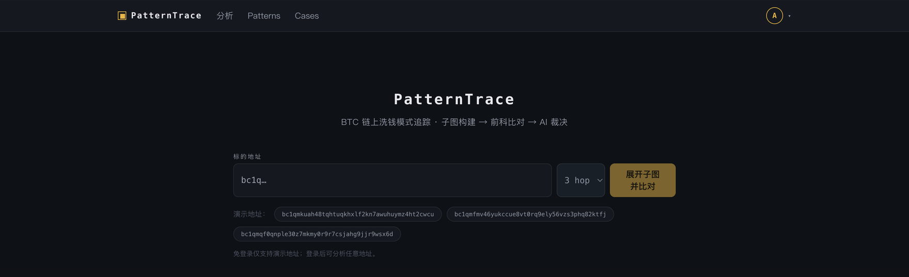
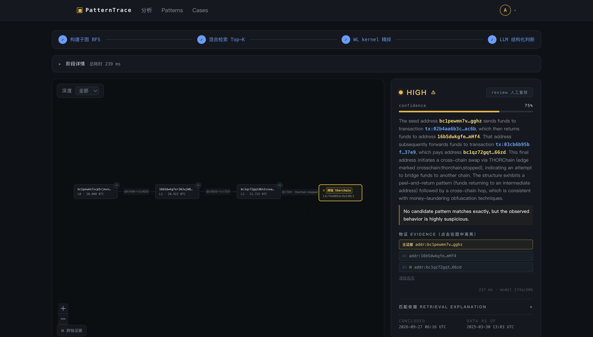

# PatternTrace

[English](README.md) | **中文**

比特币地址资金链路溯源与洗钱模式识别平台。输入任意 BTC 地址，系统以该地址为根构建受控交易
子图，与知识库中已证实的洗钱模式做结构 + 语义混合检索，再由 LLM 输出带证据引用的四档风险判断
（**high / medium / low / no_match**），并支持案件管理与报告导出。

面向链上风控调查场景，可**私有化部署**：源码 + `docker compose` 即可在自有主机拉起全部服务，
不依赖任何第三方云平台。

## 演示

**输入 BTC 地址并选择跳数**



**子图、四档判定、物证列表与匹配依据**



## 核心能力

| 能力 | 说明 |
|---|---|
| 子图构建 | BFS 三队列 + 五类终止条件（unspent / 时间窗 / 深度≤3 / 规模裁剪 / early-stop）；live 模式带重试退避、熔断切备用端点与 Redis 缓存 |
| 知识库 | Lazarus confirmed 案例切图入库（约 9,300 条 pattern），每条带 Graphormer pooled 向量 `vector(784)`（HNSW 索引）+ 检索指纹 JSONB（WL 多重集 / 金额 / 收款 / UTXO / 计数向量）；负样本独立表隔离，不参与召回 |
| 混合检索 | Graphormer pooled cosine 召回 → 三通道精排 `0.1·cos + 0.1·wljac + 0.8·ov` → Top-K |
| LLM 判断 | DeepSeek 云端主推；OpenAI 兼容 / 本地 llama.cpp 可切换；mock 可离线演示。JSON 结构化输出，evidence 统一引用地址节点（`addr:*`），非法引用经防幻觉校验重试后落 failed |
| 分析流程 | 四阶段进度条（BFS 构建 → 混合检索 → WL kernel 精排 → LLM 判断）；worker 经 Redis 上报阶段，前端流势逐格推进，失败标注在具体阶段 |
| 可视化 | React Flow 分层画布、物证点击高亮完整链路（节点 + 相邻边 + 邻接节点）、节点折叠 / 展开、混币器琥珀框双编码 |
| 业务闭环 | 案件 CRUD、地址关联、异步 PDF / HTML 报告（HMAC 签名下载）、审计日志 |
| 管理端配置 | 管理员可在「配置」页切换 LLM provider / 模型 / API Key（加密入库、即时生效），无需改环境变量重启 |

## 架构

```
frontend (Next.js + React Flow)      backend (FastAPI)            workers (arq)
        │  /api/v1（Next rewrites 同源代理）│                          │
        ├──────────────────────────────► │  JWT access+refresh      │
        │                                ├──────────────────────────┤
        │                          PostgreSQL (pgvector)   Redis (queue/cache)
                                         LLM API（DeepSeek / OpenAI 兼容 / 本地 llama.cpp）
```

浏览器只与前端同源通信（`next.config.mjs` rewrites 转发到后端），refresh cookie 始终 same-site，
登录态跨刷新可恢复。

- `backend/graph_builder/`：子图构建核心（BFS 三队列 + 五类终止条件，全局 ID 规范 `addr:*` / `tx:*` / `edge:*`）
- `backend/detection/`：CoinJoin / 跨链 OP_RETURN 运行时判定（模块化协议检测）
- `backend/retrieval/`：Graphormer 向量召回 + 检索指纹三通道精排
- `backend/llm_judge/`：provider 抽象（deepseek / OpenAI 兼容 / mock）与防幻觉结构化判断
- `backend/services/`：分析编排、报告生成、种子案例、provider 配置
- `workers/worker.py`：arq 入口（分析任务执行）
- `ingest/`：案例切图、正负样本生成、embedding 计算（一次性建库流程）
- `tests/`：单元 / 契约 / E2E / 性能测试

## 快速开始

前置：Docker，并在 `.env` 中配置 `JWT_SECRET` 与 bootstrap admin 密码（参考 `.env.example`）。

```bash
docker compose up --build          # db / redis / backend / worker / frontend
open http://localhost:3000         # 前端
open http://localhost:8000/docs    # API 文档
```

迁移由 backend 容器自动执行；bootstrap admin 账号随首启 seed。默认走 DeepSeek 云端判断，
在 `.env` 配置 `LLM_API_KEY`；离线演示免密钥（见下）。知识库向量与检索查询数据随仓库分发
（`ingest/seed/graphormer_v2/`），clone 后开箱可用。

### 离线演示（不依赖公网与真实模型）

```bash
# mock provider 三档种子案例（high / low / no_match），秒级出结论
LLM_PROVIDER=mock GRAPH_DATA_MODE=fixture python -m backend.services.seed_cases
```

### 本地推理（可选）：llama.cpp

不依赖云端 API 的本地判断走 llama.cpp（`--profile local-llm`）：

```bash
docker compose --profile local-llm up --build
```

- 模型：`unsloth/Qwen3.8-27B-GGUF:UD-Q4_K_M`（~16GB），首启自动从 HuggingFace 下载，请预留磁盘与时间
- 内存要求：Docker Desktop VM 需 ≥20GB（权重 + KV cache + 其余容器共占统一内存）
- backend/worker 切到 `LLM_PROVIDER=openai_compatible`、`LLM_BASE_URL=http://llamacpp:8080/v1`、
  `LLM_MODEL` 与 llama-server `--alias` 保持一致（判决缓存 key 含 model，两侧必须同值）

### 仅跑后端开发环境

```bash
uv sync --extra dev
docker compose up -d db redis
uv run alembic upgrade head
JWT_SECRET=dev-secret uv run uvicorn backend.api.app:create_app --factory --reload
```

## 配置参考

环境变量经 `.env` 或 compose 注入，完整默认值见 `backend/core/config.py`：

| 变量 | 说明 |
|---|---|
| `JWT_SECRET` | **必填**，运行时校验长度与熵，拒绝占位值 |
| `SECRETS_KEY` | 管理端「配置」页保存 provider API Key 的加密钥匙（`openssl rand -base64 32`）；缺失时面板无法保存密钥，env 方式不受影响 |
| `BOOTSTRAP_ADMIN_EMAIL/PASSWORD` | 首个 admin 账号，空则不 seed |
| `LLM_PROVIDER` | `deepseek`（默认，生产推荐）/ OpenAI 兼容（含本地推理）/ `mock`（测试与演示） |
| `LLM_MODEL` | 默认 `deepseek-chat`；本地推理为 llama-server `--alias`（如 `qwen3.8-27b`） |
| `LLM_BASE_URL` | 默认 `https://api.deepseek.com`；本地推理为 `http://llamacpp:8080/v1` |
| `LLM_API_KEY` | 云端 provider 密钥（也可在管理端「配置」页保存，加密入库） |
| `GRAPH_DATA_MODE` | `fixture`（内置演示图，离线）/ `live`（Esplora 公网） |
| `ESPLORA_API_URL` | live 数据源，默认 `https://mempool.space/api`（自动切 Blockstream 备用） |
| `ADDRESS_TX_COUNT_LIMIT` | live 模式地址活跃度预检阈值（默认 200）：交易数超限直接拒绝分析，避免高活跃地址拖垮建图 |
| `HTTP_PROXY` / `HTTPS_PROXY` / `NO_PROXY` | 出站 HTTP 代理；受限网络下 live 数据源与 LLM API 必需 |
| `DEMO_SEEDS` | 匿名免登录白名单地址 CSV；空则用内置 seed |
| `CORS_ORIGINS` | CORS 显式白名单 CSV，默认放行 `localhost:3000`；生产注入正式域名 |
| `API_PROXY_URL` | 前端构建期注入：rewrites 转发目的地（compose 内为 `http://backend:8000`） |
| `COOKIE_SECURE` | 生产置 `true`（Cookie 带 Secure + SameSite=None，支持前后端分域） |

## 开发与测试

```bash
uv sync --extra dev
bash infra/run_unit_tests.sh        # 后端单元 + 契约测试（自动建独立测试库 patterntrace_test）
cd frontend && npm test             # 前端 vitest
cd frontend && npm run type-check && npm run lint

python -m scripts.gen_api_types     # OpenAPI schema 变更后同步前端契约
```

**后端测试必须走 `infra/run_unit_tests.sh`**：测试含全表清理，而默认 `DATABASE_URL` 指向开发库
（与本地栈共用同一个 Postgres），直接 `uv run pytest` 会清空开发库中正在查看的分析记录。该约定
由 `scripts/db_guard.py` 在代码层强制——破坏性用例只允许库名为 `patterntrace_test` / `pt_e2e` /
`*_test`，指向其它库直接报错。

CI（GitHub Actions）在 PR 上跑后端 lint / 测试 / 契约守护、前端 lint + type-check + vitest + build，
以及一条完整 E2E（分析 → 判断 → 报告真实走一遍，含独立 worker 队列形态）。CI 只做验证门禁，
交付形态是下述 docker compose 私有化部署。

## 部署

本项目定位为**可私有化部署**：源码 + `docker compose` 一套编排，即可在自有主机拉起全部服务。

```bash
git clone <repo> && cd pattern_trace
cp .env.example .env          # 填写 JWT_SECRET / LLM_API_KEY / 数据源等
docker compose up --build     # db / redis / backend / worker / frontend
open http://localhost:3000
```

- **迁移自动执行**：backend 容器启动即 `alembic upgrade head`，无需单独步骤。
- **生产口径**：live 数据源 + DeepSeek 云端判断；如需本地推理可加 `--profile local-llm`
  （首启下载 ~16GB 模型，内存 ≥20GB）。
- 生产加固项（`COOKIE_SECURE`、`CORS_ORIGINS`、反向代理等）由 `.env` 注入，`docker compose`
  自行编排，不绑定任何平台。

## 安全基线

- 密码哈希 bcrypt cost 12（存量 pbkdf2 哈希兼容验证，平滑过渡）
- JWT access(15min) + refresh rotation（reuse detection，状态存 Redis 原子轮换；Redis 不可达降级进程内）；
  refresh **仅经 HttpOnly Cookie 下发、绝不出现在响应 body**
- 写请求强制 `X-Requested-With`（服务端强制 CSRF 校验，非依赖前端自觉）
- CORS 显式白名单：`allow_credentials=True` 时禁止通配符
- 水平越权隔离：非本人案件 / 报告一律 404 并落审计日志
- 报告下载 URL：HMAC-SHA256 签名 + 15 分钟过期
- 管理端 provider 密钥：Fernet 加密入库，接口永不回显明文，只回 `key_source` / `has_key`
- 生产（`COOKIE_SECURE=true`）：Cookie 附 Secure + SameSite=None，支持分域部署

## License

[MIT](LICENSE)
