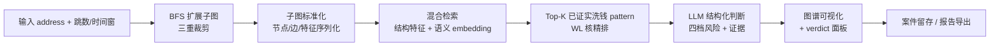

# PatternTrace · 链上洗钱模式检索与判断平台

> 工作名：PatternTrace（可随时更换）
> 状态：设计定稿，待开发
> 更新日期：2026-08-04

## 1. 项目概述

**一句话定位**：输入一个区块链地址，系统以该地址为根节点扩展交易子图，与知识库中**已证实的洗钱交易子图**做结构与语义相似度检索，由 LLM 给出带证据的风险判断（四档），支持案件留存与报告导出。

**目标用户**：交易所 / 机构风控调查员（对应 Bybit Trace 团队的真实工作场景）。

**核心价值**：

- 把"这个地址像不像已知洗钱手法"变成可检索、可解释、可留证的产品能力；
- 不依赖全量实体图谱（与 Chainalysis 等错位竞争），专注"已知洗钱 pattern 的可解释检索器"；
- 用可配置 LLM provider 输出结构化判断，降低调查员的初筛成本。

**与个人经历的关联**（面试叙事）：

- 链上取证能力：Lazarus Group 归因项目（30,139 个确认命中地址、70.5% 召回、2,590 BTC 混币器输出）；
- 领域知识：Bybit 实习期间测试过 Trace / Redis / MySQL / Kafka / gRPC 模块，熟悉真实调查业务流程；
- 工程能力：Skill-Reducer 沉淀的 LLM 工具工程经验（结构化输出、质量评估）；
- 数据能力：量化交易经历形成的假设-验证-迭代闭环。

## 2. 产品逻辑

### 2.1 主流程



### 2.2 风险判断模型（固定四档）

| risk_level | 含义 | recommended_action |
|---|---|---|
| high | 命中已知洗钱 pattern 且置信度高 | freeze（冻结/拦截） |
| medium | 存在部分相似特征，需进一步排查 | monitor（监控） |
| low | 与已知 pattern 无明显相似 | none |
| no_match | 未命中任何已知 pattern | review（人工复核） |

**关键原则**：`no_match` ≠ 安全。未命中已知 pattern 不代表地址干净，默认进入人工复核队列。四档判断永远成立，产品逻辑闭环。

## 3. 已确认决策（2026-08-04）

1. **数据范围**：MVP 限定最近 N 天（默认 90 天，可配置）+ 预置演示地址集；历史数据回灌、任意地址全历史支持列入后续扩展（P2）。
2. **LLM 供应商**：可配置 provider 抽象，统一接口支持 OpenAI / Anthropic / 本地模型（Ollama、vLLM 等），通过环境变量切换；同时覆盖 AI 方向求职叙事。
3. **演示种子案例**：包含边界案例（形态类似洗钱但实际正常的地址），用于展示 `no_match` → `review` 的兜底逻辑。

## 4. 差异化定位

不做 Chainalysis / TRM Labs 式的全量实体图谱与地址标签体系，聚焦：

- **已知洗钱 pattern 的结构检索**：回答"这个子图结构上像不像已知的 N 类洗钱模式"；
- **LLM 可解释判断**：给出四档风险结论，并引用输入子图中真实存在的节点/交易作为证据；
- **案件闭环**：从初筛到案件留存、报告导出，覆盖调查员的最小工作流。

## 5. 数据方案

### 5.1 链上数据源（MVP）

- **Blockstream Esplora 公共 API**：免费、无需 key，作为地址/交易数据服务的数据源；
- **自建标签表**：混币器地址、交易所地址、已知黑客地址（公开清单 + Lazarus 项目沉淀），存 PostgreSQL；
- **数据范围**：最近 N 天（默认 90 天）+ 预置演示地址；Esplora 限流通过缓存 + 批量预取缓解。

### 5.2 RAG 知识库（已证实洗钱子图）

| 类别 | 来源 | 规模 | 说明 |
|---|---|---|---|
| 正样本 | Lazarus 项目确认命中 | 30,139 地址 / 2,590 BTC 混币器输出 | 按三阶段洗钱结构（入金 → 混币 → 分拆出金）切子图 |
| 负样本 | 普通钱包地址构造 | 3:1 负正比 | 无混币器接触、无黑名单标签的同等规模子图 |
| 扩充（P1+） | Elliptic 公开数据集 | - | 标注 illicit/licit，验证泛化性 |

知识库每条记录包含：

1. 规范序列化的子图（节点/边/特征摘要，供 LLM 引用）；
2. 结构特征向量（图元计数、出入度分布、密度、混币器接触、链长等）；
3. pattern 语义描述 embedding（如"3 层分层：混币器入金 → 多跳小额拆分 → 交易所出金"）；
4. 证据等级（A = 归因模型确认，B = 人工复核）与来源；
5. 子图指纹（graphlet / WL 特征，用于精排）。

> 知识库正样本可直接复用 btc_aml_forensics 已产出的子图数据：
> `/Users/gwenlita/Documents/bybit_rust/golden/python/results/step3_subgraph/`
> （`subgraph_nodes.parquet`、`subgraph_edges.parquet`、`_edges_batches/*`），
> 及 `results/step2_label/` 的标注输出，作为入库脚本的数据源。

## 6. 子图构建（BFS）设计（P0 工程决策）

**参考实现**：`/Users/gwenlita/Documents/bybit_rust`（btc_aml_forensics，即简历中 Lazarus 取证项目本体）。

- Rust 实现：`src/step3/step3_sub2_bfs_loop.rs`
- Python 基线：`code/src/step3/step3_sub2_bfs_loop.py`
- 数据结构与预处理：`src/step3/step3_sub1_preprocessing.rs`

产品中的 BFS 直接沿用该实现的算法语义与特征 Schema，数据源与存储做适配（详见 6.5）。

### 6.1 分层三队列 BFS

- **队列元素 = UTXO 元组** `(utxo_txid, output_index, owner)`，与基线
  `QueueEntry` 同构（不是地址节点）；展开单元是一次 UTXO 消费（spent_by 解析），
  而非旧实现的「地址→全部交易」。
- `layer0_queue` → tx2 边（depth 1）、`layer1_queue` → tx3 边（depth 2）、`layer2_queue` → tx4 边（depth 3）；
- 最大深度固定 3 层（与产品"默认 3 跳"一致）；
- 原实现种子为 CoinJoin final_exit UTXO，产品中根节点为用户输入地址，其余逻辑一致；
- 每轮对每层队列做**快照处理**（snapshot 语义）：只处理本轮开始时队列中的条目，展开产生的新条目留待下一轮/后续批次。

### 6.2 五类终止条件（直接复用）

1. `unspent`：UTXO 在数据范围内未被花费；
2. `out_of_range`：花费交易超出数据范围（对应 MVP"最近 N 天"的边界语义）；
3. `early_stop`：花费交易属于 CoinJoin/混币交易集合（wasabi）或跨链 OP_RETURN 交易集合（crosschain）→ 记录边并停止扩展；
4. `tx4_new_dst`：depth 3 边的目标地址是此前未见过的地址 → 硬停止；
5. `queue_empty`：三个队列全部耗尽。

### 6.3 黑洞 / early-stop 语义（比"混币器节点黑洞"更精确）

原实现**不是**"遇到混币器地址就停止"，而是交易级判定：

- spending tx 属于 `coinjoin_txids` 集合 → 生成 `is_stopped_expansion=true` 的边，不再向该交易内部展开；
- spending tx 被运行时 `CrosschainDetector` 判定为跨链（OP_RETURN / pegout 协议）→ 同样 early-stop，并记录 `op_return_protocol`；判定完全来自 Esplora 交易字段，无 crosschain_tx_set / CSV 标签库（issue #5）；
- 前置阶段需要构建：CoinJoin/混币交易集合（跨链集合不再需要，由运行时检测）。

因此产品的标签表除了地址标签，还必须包含**交易级集合**：已知 CoinJoin/混币交易（跨链桥协议改由运行时 CrosschainDetector 判别）。这是与 bybit_rust 对齐的关键。

### 6.4 去重与节点/边状态

- `seen_utxos` 使用精确复合键 `(txid, output_index, address)`，禁止 hash 截断（防碰撞导致节点遗漏）；
- 节点状态（`NodeState`）：`first_layer`、`layer_span`、`total_received_btc`、`total_sent_btc`、`utxo_count`、`direct_related_to_lazarus`、`script_type`；
- 边特征（复用 `model::Edge` Schema）：`time_delta`（块高差 + 交易索引差）、`total_num_inputs/outputs`、`tx_fee_ratio`、`fanout_ratio`、`dst_value_btc`、`tx_total_input/output_btc`、`value_ratio`、`is_stopped_expansion`、`is_remixer`、`is_crosschain`、`op_return_protocol`。

这些节点/边特征就是后续结构指纹与检索特征向量的直接输入，Schema 与 bybit_rust 保持一致，可无缝复用其已产出子图。

### 6.5 工程机制与 MVP 适配

| 原实现（btc_aml_forensics） | 产品 MVP 适配 |
|---|---|
| 块高分区 Parquet + 二分定位 + LRU 缓存 | Esplora API 按需取数，服务层缓存（保留"按范围定位"思路） |
| 批处理 100K + 边流式落盘 | 单地址分析规模小，批处理简化；边写入 PostgreSQL |
| checkpoint 断点续跑（bincode + parquet + 原子写） | MVP 用 Redis 任务状态即可，完整恢复放 P1 |
| mmap 索引 / npy | PostgreSQL 索引 + 缓存 |
| 全量批量处理（数万种子） | 单根地址查询，三重规模裁剪（见 6.6） |

### 6.6 规模裁剪规则（产品层新增）

原实现是全量批处理，产品需要额外加规模控制，防止真实链上扇出爆炸：

- 跳数默认 3（对应原实现固定 3 层）；
- 每层节点数上限 50；
- 子图总节点上限 200；
- 异常扇出截断：单节点出度超过阈值时折叠为摘要节点（原实现通过 `tx4_new_dst` 硬停部分兜底）；
- 黑洞沿用 6.3 的 early-stop 语义（CoinJoin / 跨链 OP_RETURN 交易）。

## 7. 检索方案（混合检索 + 精排）

图不适合直接做文本切块 RAG，结构信息是洗钱判断的核心信号，因此分层设计：

### 7.1 召回层

- 结构特征向量 + pattern 语义 embedding，混合查询 **pgvector（HNSW 索引）**；
- 召回 Top-20；
- MVP 不用独立向量库（不引入 Milvus/Qdrant）。

### 7.2 精排层

- 对候选子图与召回结果计算 **Weisfeiler-Lehman 子树核相似度**；
- 取 Top-3 ~ 5 进入 LLM 上下文；
- 伪同构风险通过精排 + LLM 上下文中"差异说明"缓解。

### 7.3 演进

- P1+：graph2vec 子图级嵌入，替代部分结构特征向量；
- P2：图数据库（Neo4j）评估，当图查询成为瓶颈时再引入。

## 8. LLM 判断服务

### 8.1 Provider 抽象

- 统一接口 `LLMClient.complete(messages, json_schema)`；
- 实现：OpenAI、Anthropic、Ollama / vLLM（本地）；
- 通过环境变量切换：`LLM_PROVIDER` / `LLM_MODEL` / `LLM_BASE_URL` / `LLM_API_KEY`。

### 8.2 结构化输出（JSON Schema 强制）

```json
{
  "risk_level": "high | medium | low | no_match",
  "matched_pattern": "mixer_layering_3hop | null",
  "confidence": 0.0,
  "evidence": ["<输入子图中真实存在的节点/交易 ID>"],
  "reasoning": "……",
  "recommended_action": "freeze | monitor | review | none"
}
```

### 8.3 防幻觉

- System prompt 声明：无匹配时必须输出 `no_match`；
- 代码层校验 `evidence` 引用的节点/交易 ID 必须存在于输入子图，越界引用直接拒绝该输出并重试；
- 判断结果按 `(address, subgraph_hash, model, prompt_version)` 缓存到 Redis；
- prompt 版本化，评估结果与版本绑定。

## 9. 技术架构

### 9.1 仓库结构（monorepo）

```
laundering-pattern-intel/
├── frontend/                 # Next.js + TypeScript + React Flow
│   ├── app/                  # 地址查询、图谱页、verdict 面板、案件页
│   └── components/           # GraphCanvas、VerdictCard、CaseList
├── backend/                  # FastAPI + SQLAlchemy + Alembic
│   ├── api/                  # /auth /addresses /patterns /judgments /cases
│   ├── services/             # 判断编排、案件、报告
│   └── core/                 # 配置、安全、审计日志
├── services/
│   ├── graph-builder/        # BFS 拓展（参考 bybit_rust Step3）+ 规模裁剪（P0）
│   ├── retrieval/            # 指纹计算 + pgvector 混合检索 + WL 精排
│   └── llm-judge/            # provider 抽象 + 结构化判断 + 引用校验
├── ingest/                   # Lazarus 数据切图、负样本、标签表、入库脚本
├── infra/                    # docker-compose、GitHub Actions、部署配置
├── tests/                    # 单元/集成/E2E、检索评估脚本
└── docs/                     # 架构图、API 文档、评估报告
```

### 9.2 技术栈

| 层 | 选型 | 理由 |
|---|---|---|
| 前端 | Next.js + TypeScript + Tailwind + React Flow + Zustand | 前后端分离 SPA，图可视化成熟 |
| 后端 | FastAPI + SQLAlchemy + Alembic + Pydantic | Python 生态，与检索/LLM 服务无缝 |
| 数据库 | PostgreSQL + pgvector | 关系数据 + 向量检索一体，MVP 不引入独立向量库 |
| 缓存/队列 | Redis + Celery | 判断缓存、子图构建与入库异步任务 |
| 鉴权 | JWT + 角色（调查员） | 前后端分离标准方案 |
| 基础设施 | Docker Compose + GitHub Actions | 本地一键启动 + CI/CD |
| 部署 | docker compose 私有化部署（自托管 DB/Redis，LLM 可走云端） | 客户自有主机一键拉起 |

### 9.3 核心 API

| 方法 | 路径 | 说明 |
|---|---|---|
| POST | /api/v1/auth/login | JWT 登录 |
| POST | /api/v1/addresses/analyze | 输入 address + 跳数 + 时间窗 → 子图 + verdict |
| GET | /api/v1/addresses/{address}/subgraph | 获取子图（供前端渲染） |
| GET | /api/v1/patterns | 知识库 pattern 列表 |
| GET | /api/v1/patterns/{id} | pattern 详情（含规范序列化子图） |
| GET | /api/v1/judgments/{id} | 判断详情 |
| POST | /api/v1/cases | 创建案件 |
| GET | /api/v1/cases/{id} | 案件详情 |
| POST | /api/v1/cases/{id}/reports | 导出证据报告 |

### 9.4 核心数据模型

- `users`：账号、角色
- `addresses_meta`：地址元数据、标签、风险缓存
- `patterns`：知识库洗钱 pattern（规范子图、特征向量、语义描述、证据等级）
- `judgments`：判断记录（子图快照、LLM 输出、prompt 版本、模型）
- `cases` / `case_addresses`：案件与关联地址
- `audit_logs`：关键操作审计

## 10. 6 周路线图

| 周 | 内容 | 验收 |
|---|---|---|
| W1 | monorepo 骨架、docker-compose、DB schema（Alembic）、JWT 认证、BFS 子图构建器（参考 bybit_rust 三队列 BFS + 规模裁剪） | 本地一键启动；输入地址返回受控子图，终止条件统计与 bybit_rust 对齐 |
| W2 | ingest：Esplora 数据源、Lazarus 数据切图、负样本生成、标签表、pgvector 入库 | 知识库可查询，正负样本比例达标 |
| W3 | retrieval 服务：结构指纹 + 混合检索 + WL 精排 | recall@10 基线跑通并记录 |
| W4 | llm-judge：provider 抽象、JSON Schema、引用校验；前端图谱 + verdict 面板 | 端到端：地址 → 子图 → 判断 → 可视化 |
| W5 | 案件管理、报告导出、审计日志、3 个种子案例 | 完整工作流可用 |
| W6 | 单元/集成/E2E 测试、CI/CD、部署、README + 演示视频 | 公网可访问，种子案例 30 秒出结论 |

**P2（明确砍掉，写入 README 路线图）**：实时告警、graph2vec、历史数据回灌、多链支持、移动端、WebGL 大图渲染。

## 11. 演示与种子案例

1. **已知洗钱地址**（Lazarus 确认命中）→ 期望 `high`，展示命中 pattern 与证据；
2. **普通 P2P 地址** → 期望 `low`；
3. **边界案例**（形态类似洗钱但实际正常，如大额交易所提现聚合）→ 期望 `no_match` + `review`，展示兜底逻辑。

体验策略：公网部署，只读演示免登录，写操作需登录。

## 12. 评估指标

| 指标 | 定义 | 目标 |
|---|---|---|
| 检索 recall@10 | 留出集中已知洗钱地址的 Top-10 召回率 | ≥ 80%（基线） |
| LLM 判断准确率 | 留出集四档判断与人工标注一致率 | ≥ 85% |
| 误报 / 漏报 | high/low 错判分布（freeze 是高代价动作） | 漏报优先于误报 |
| 判断延迟 p95 | 子图 + 检索 + LLM 全链路 | ≤ 10s（MVP） |

评估数据：Lazarus 确认数据留出 20% 作测试集 + 人工复核标签。

## 13. 风险与对策

| 风险 | 对策 |
|---|---|
| Esplora 限流 / 数据获取失败 | 地址与子图缓存、批量预取、演示地址预取 |
| BFS 爆炸 | 三重裁剪 + 混币器黑洞 + 基准测试 |
| LLM 幻觉 / 引用越界 | JSON Schema + 引用校验 + 重试 + no_match 兜底 |
| 判断不稳定 | prompt 版本化 + 结果缓存 + 评估绑定版本 |
| 知识库冷启动规模小 | 负样本补齐 + Elliptic 扩充（P1+） |

## 14. 面试叙事要点

- "我在 Bybit 测试 Trace 模块时发现了真实业务痛点，把它产品化了"；
- 三个数字：30,139 个确认命中地址、70.5% 归因召回、2,590 BTC 混币器输出；
- 技术深度：图检索分层设计（为什么文本 RAG 不适合图）、LLM 防幻觉、检索评估闭环；
- 产品逻辑：no_match ≠ 安全，边界案例展示判断模型的可信度。

## 15. 后续决策点

- 项目正式名称；
- 部署预算（免费层即可，或需要付费实例）；
- 是否在 MVP 阶段引入人工复核反馈回路（调查员对判断结果的纠正是否回流为标注数据）。
